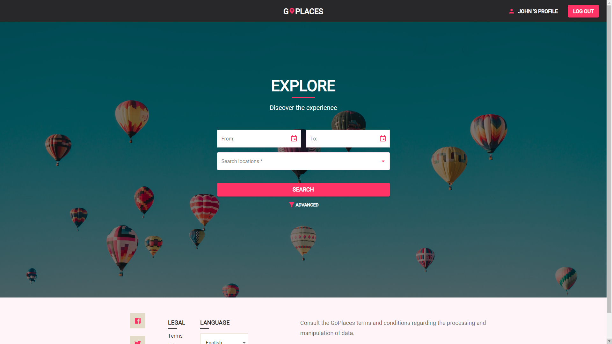
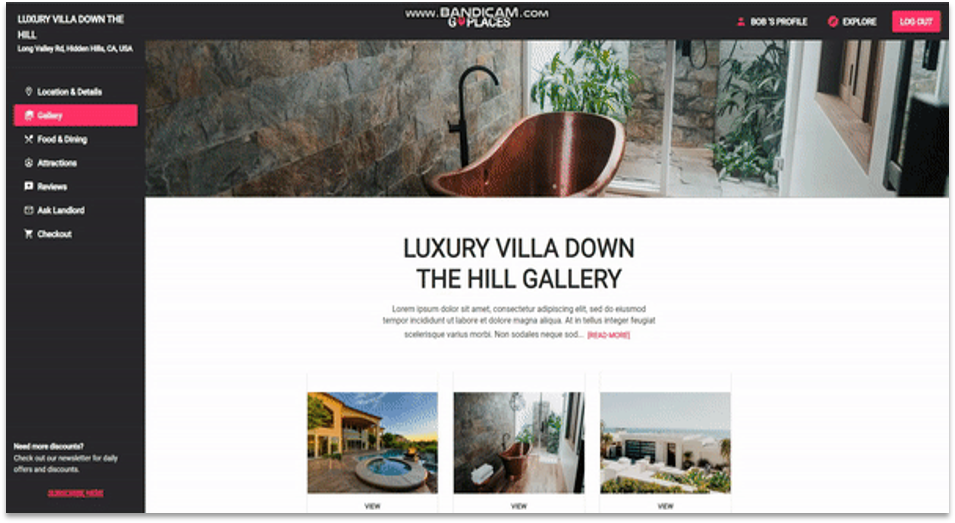

# GoPlaces! App

Full-stack MERN application (Bachelor's Degree Final Project)

Offers services for both customers and owners :) !

FrontEnd: ReactJs;
BackEnd: Express, Node;
Database: MongoDb;

# installation

    * In order to install all the dependencies, please run the following command under both /frontend and /go-places-app-master directories:
         npm install

# start

    * In order to start the application, please run the following command under /go-places-app-master directory:
         npm run dev

# project content

- Initial Page
  
- Sign Up Page
  
- Sign In Page
  
- Explore Page
  
- Search functionality based on filters - location, date

- USER AREA (accessible by clicking on My Profile button)
  
- My Account Page - Adjust personal information to be used when booking a property
  
- My Listings Page - A list for all the listings the user has posted
  
- Section for adding a property listing
  
- Dashboard - See statistics: customers, bookings, planned trips,
  

- PROPERTY AREA (accessible after searching and selecting a property)

- Property detais
  
- Photo Gallery
  
- Restaurants in the area
  
- Activities in the area
  
- Reviews from users who booked the property at least once
  
- Contact the owner (Section available only if the property belongs to someone else)
  
- Checkout form (Section available only if the property belongs to someone else)
  
- Answer Customers (Section available only if the property belongs to the user)
  

# dependencies

    * concurrently: runs both 'npm run server' & 'npm run client'
    * dotenv

# front-end:

    * react-router-dom
    * swiper: image slider
    * axios: handler for HTTP requests
    * react-paginate
    * react-toastify: frontend error handler
    * google-map-react
    * Material UI packages

# back-end

    * Express: tooling for HTTP services
    * express-async-handler: exception handler
    * mongoose: object modelling tool which supports both promises and  callbacks; creates the model for our collection, where we can find other documents from the same collection
    * bcryptjs: hashing & checking passwords
    * jsonwebtoken: generate tokens
    * nodemon
    * cors
    * multer
