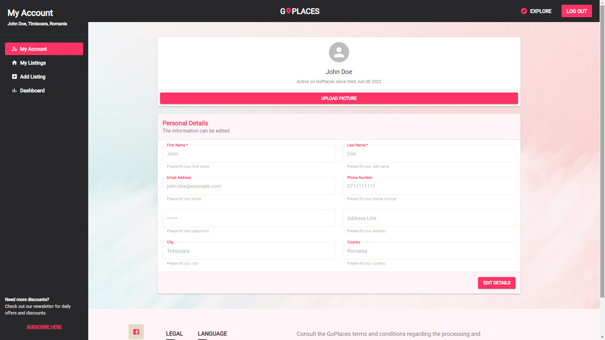
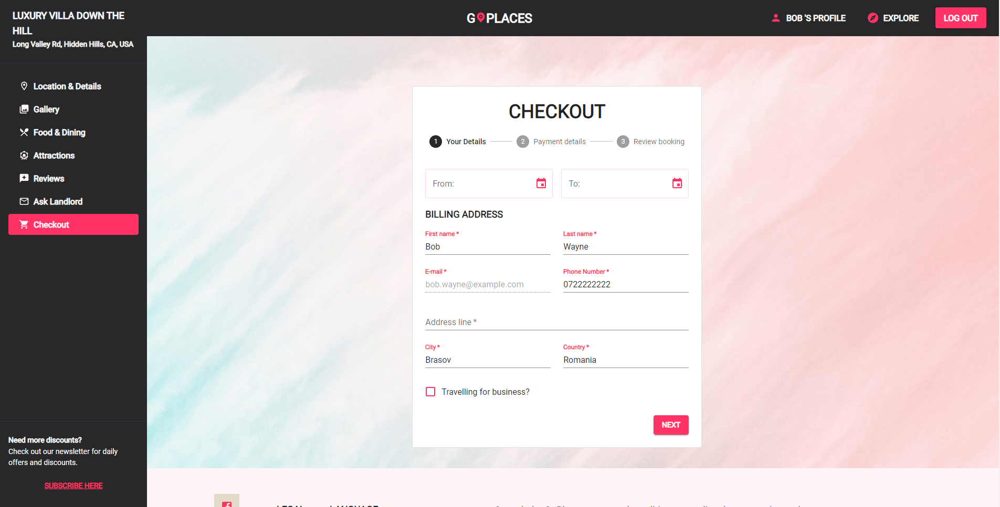

# GoPlaces! App

Full-stack MERN application (Bachelor's Degree Final Project)

FrontEnd: ReactJs;
BackEnd: Express, Node;
Database: MongoDb;

# installation

    * In order to install all the dependencies, please run the following command under both /frontend and /go-places-app-master directories:
         npm install

# start

    * In order to start the application, please run the following command under /go-places-app-master directory:
         npm run dev

# project content

# dependencies

    * concurrently: runs both 'npm run server' & 'npm run client'
    * dotenv

# front-end:

    * react-router-dom
    * swiper: image slider
    * axios: handler for HTTP requests
    * react-paginate
    * react-toastify: frontend error handler
    * google-map-react
    * Material UI packages

# back-end

    * Express: tooling for HTTP services
    * express-async-handler: exception handler
    * mongoose: object modelling tool which supports both promises and  callbacks; creates the model for our collection, where we can find other documents from the same collection
    * bcryptjs: hashing & checking passwords
    * jsonwebtoken: generate tokens
    * nodemon
    * cors
    * multer
